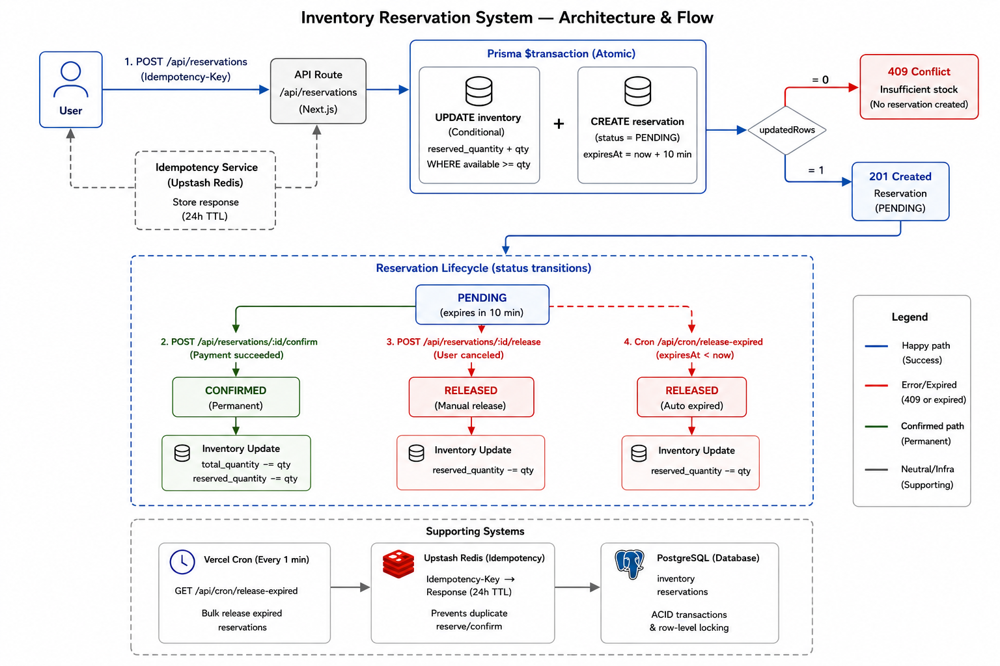

# Architecture — Inventory Reservation System

## Problem context

When a customer proceeds to checkout in a multi-warehouse retail platform, two competing risks exist:

- **Decrement at payment time**: Two customers can pay simultaneously for the same last unit. One gets a refund, the other a bad experience. Operations has to clean up manually.
- **Decrement at add-to-cart**: Inventory appears depleted even though 80% of carts are abandoned. Conversion tanks.

The correct solution is a **temporary reservation**: hold units when the customer enters checkout, confirm the hold permanently when payment succeeds, or release it if payment fails or the timer expires.

---

## Inventory model

```
totalQuantity    = physical units in the warehouse
reservedQuantity = units currently held by pending reservations
availableQuantity = totalQuantity - reservedQuantity  (computed, not stored)
```

`totalQuantity` only decrements permanently when a reservation is **confirmed** (payment succeeded). It never changes during a reserve or release.

---

## Reservation lifecycle

```
User clicks "Reserve"
       |
       v
  [PENDING] ──── 10 min timer ────> auto-released (RELEASED)
       |
       |── "Confirm purchase" ────> [CONFIRMED]  (total -= qty, reserved -= qty)
       |
       └── "Cancel" ─────────────> [RELEASED]   (reserved -= qty)
```

---

## The core concurrency problem

Consider two users attempting to reserve the last unit simultaneously:

```
Inventory: totalQuantity=1, reservedQuantity=0 → available=1

Request A: reads available=1 ✓
Request B: reads available=1 ✓
Request A: UPDATE reservedQuantity = 0+1 → success
Request B: UPDATE reservedQuantity = 0+1 → success (OVERSELL)
```

A naive read-then-update pattern (fetch inventory, check if available > 0, then update) is broken because both reads happen before either write. This is a classic TOCTOU (time-of-check to time-of-use) race condition.

---

## Solution: atomic conditional UPDATE

The fix is to make the availability check and the increment a single atomic database operation:

```sql
UPDATE inventory
SET reserved_quantity = reserved_quantity + :qty
WHERE product_id = :productId
  AND warehouse_id = :warehouseId
  AND (total_quantity - reserved_quantity) >= :qty
```

If `updatedRows === 0`, the condition failed — insufficient stock — return HTTP 409. If `updatedRows === 1`, the reservation succeeded. Both the check and the increment happen in the same atomic write. No two concurrent transactions can both satisfy the WHERE clause for the last unit.

This is wrapped in a Prisma `$transaction` so the subsequent reservation record creation is also atomic with the inventory update.

---

## Why not Redis distributed locks?

Many engineers' first instinct is to add a Redis lock around the reservation logic. This is unnecessary here and actually weaker:

1. **Redis locks do not replace DB consistency.** Even with a Redis lock, the database transaction must still be correct. The lock is redundant.
2. **Redis locks add failure modes.** Lock expiry, network partitions, and lock release bugs can cause deadlocks or silently skipped locks.
3. **PostgreSQL already provides the guarantee.** Row-level locking via a conditional UPDATE is atomic by definition — this is what databases are built for.

Redis is used in this project for **idempotency** (see below), which is what it is actually well-suited for.

---

## Reservation expiry — hybrid approach

Reservations that are not confirmed within 10 minutes must be released automatically so the units return to available stock. Two mechanisms work together:

### 1. Lazy expiry (correctness layer)
Every time a reservation is read (GET /api/reservations/:id, or before confirm/release), the system checks if `status === PENDING && expiresAt < now`. If so, it calls `releaseReservation()` before returning. This ensures any active user flow always sees consistent state.

### 2. Cron cleanup (eventual consistency layer)
A Vercel Cron job runs every minute hitting `GET /api/cron/release-expired`. It finds all reservations where `status=PENDING AND expiresAt < now` and releases them in bulk. This handles abandoned reservations where no further reads occur.

Together: lazy expiry guarantees correctness for active flows; cron guarantees eventual cleanup for abandoned ones.

---

## Idempotency

Clients retry requests due to network timeouts, mobile connectivity drops, or double-clicks. Without idempotency protection, a retry could create a duplicate reservation or double-confirm a payment.

The reserve and confirm endpoints accept an optional `Idempotency-Key` header. On first request with that key, the response is stored in Upstash Redis with a 24-hour TTL. On any subsequent request with the same key, the stored response is returned immediately — the side effect does not repeat.

---

## Trade-offs and what I'd change at scale

| Decision | Rationale | At 10× scale |
|---|---|---|
| No optimistic locking (version field) | Conditional UPDATE is sufficient for this concurrency level | Add version field + retry loop for high-contention SKUs |
| Cron granularity = 1 minute | Acceptable for a 10-minute reservation window | Move to queue-based expiry (e.g. BullMQ delayed jobs) for sub-second precision |
| Single Postgres instance | Sufficient for take-home scope | Read replicas for product listing queries |
| No per-user auth | Out of scope for this exercise | Add JWT/session to bind reservations to a user |
| Synchronous confirm | Simple and correct | At high volume, confirm via a payment webhook queue |

---

## Architecture diagram



---

## Folder structure

```
app/
  api/
    products/route.ts         GET — list products with available stock
    warehouses/route.ts       GET — list warehouses
    reservations/
      route.ts                POST — create reservation (atomic)
      [id]/route.ts           GET  — fetch reservation (with lazy expiry)
      [id]/confirm/route.ts   POST — confirm reservation
      [id]/release/route.ts   POST — release reservation
    cron/
      release-expired/route.ts  GET — bulk release expired reservations (Vercel Cron)
  products/page.tsx           Product listing UI
  reservation/[id]/page.tsx   Checkout/reservation UI

lib/
  db.ts                       Prisma singleton client
  redis.ts                    Upstash Redis singleton client
  reservation-service.ts      All reservation business logic
  idempotency-service.ts      Redis-backed idempotency helpers
  errors.ts                   Typed error classes
  schemas.ts                  Shared Zod schemas

prisma/
  schema.prisma
  seed.ts

docs/
  architecture.md             (this file)
  architecture-diagram.svg    System flow diagram

scripts/
  test-concurrency.ts         Proves oversell prevention under load
```
---
